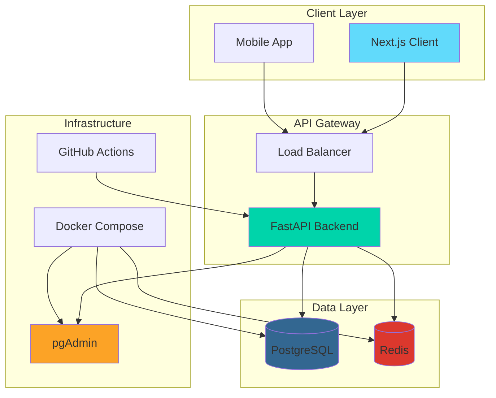
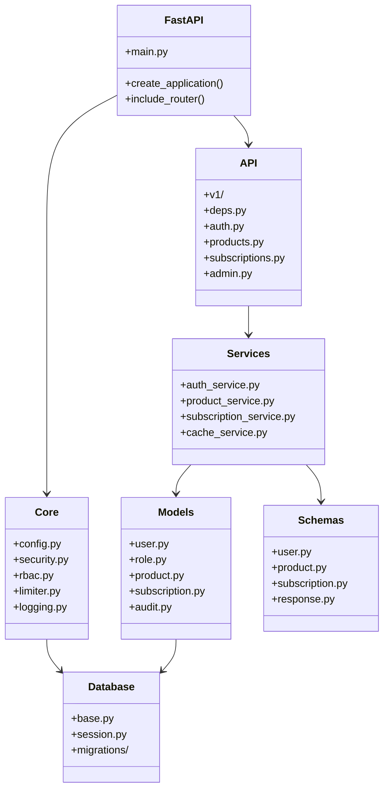
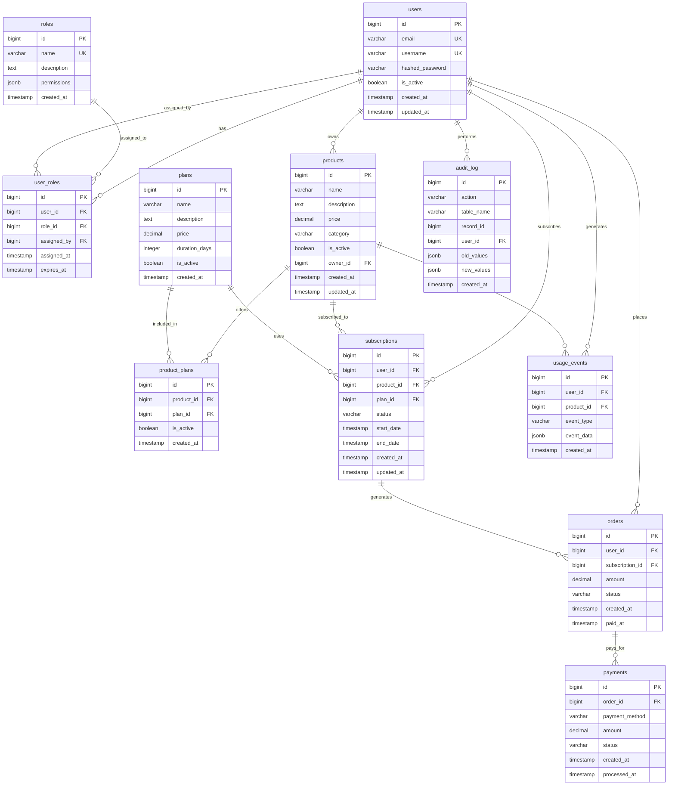

# Системная архитектура Neuro Store

## Навигация
- [Общая схема](#общая-схема)
- [Пакетная структура backend](#пакетная-структура-backend)
- [Схема базы данных](#схема-базы-данных)
- [Компоненты системы](#компоненты-системы)
- [Нефункциональные требования](#нефункциональные-требования)

## Общая схема



## Пакетная структура backend



## Схема базы данных



## Компоненты системы

### Аутентификация и безопасность

**JWT токены**
- **Реализация:** `app/core/security.py`
- **Функции:** Создание, валидация, обновление токенов
- **Безопасность:** RSA ключи, короткое время жизни access токенов

**RBAC система**
- **Реализация:** `app/core/rbac.py`
- **Роли:** admin, moderator, user, viewer
- **Проверка:** Dependency injection в FastAPI эндпоинтах

**Rate Limiting**
- **Реализация:** `app/core/limiter.py`
- **Стратегия:** По IP адресу и пользователю
- **Лимиты:** Настраиваемые по эндпоинтам

### Кэширование и производительность

**Redis кэш**
- **Реализация:** `app/services/cache.py`
- **Назначение:** Сессии, кэш продуктов, rate limiting
- **Стратегия:** TTL с автоматическим обновлением

**Оптимизация БД**
- **Индексы:** По часто используемым полям
- **Представления:** Агрегированные данные для отчетности
- **Процедуры:** Сложная бизнес-логика

### Миграции и версионирование

**Alembic миграции**
- **Конфигурация:** `alembic.ini`
- **Структура:** `db/migrations/`
- **Команды:** upgrade, downgrade, revision

**Backup и Restore**
- **Скрипты:** `ops/backup/`
- **Автоматизация:** Cron jobs для регулярного резервного копирования
- **Хранение:** Локальные файлы + облачное хранилище

## Нефункциональные требования

### Логирование

**Структурированное логирование**
- **Библиотека:** structlog
- **Формат:** JSON для машинного чтения
- **Уровни:** DEBUG, INFO, WARNING, ERROR, CRITICAL
- **Контекст:** User ID, Request ID, Endpoint

```python
# app/core/logging.py
import structlog

logger = structlog.get_logger()

# Пример использования
logger.info(
    "User action",
    user_id=user.id,
    action="product_created",
    product_id=product.id
)
```

### Обработка ошибок

**Глобальные обработчики**
- **HTTP ошибки:** Стандартные коды состояния
- **Валидация:** Pydantic ValidationError
- **Бизнес-логика:** Кастомные исключения
- **Логирование:** Автоматическое логирование ошибок

```python
# app/core/exceptions.py
from fastapi import HTTPException, status

class InsufficientPermissionsError(HTTPException):
    def __init__(self, detail: str = "Недостаточно прав"):
        super().__init__(
            status_code=status.HTTP_403_FORBIDDEN,
            detail=detail
        )

class ResourceNotFoundError(HTTPException):
    def __init__(self, resource: str, resource_id: int):
        super().__init__(
            status_code=status.HTTP_404_NOT_FOUND,
            detail=f"{resource} с ID {resource_id} не найден"
        )
```

### Тестирование

**Стратегия тестирования**
- **Unit тесты:** pytest для всех модулей
- **Интеграционные тесты:** API эндпоинты
- **Тестовая БД:** SQLite in-memory для изоляции
- **Mock объекты:** Заглушки для внешних сервисов

**Покрытие кода**
- **Инструмент:** pytest-cov
- **Цель:** Минимум 80% покрытия
- **Отчеты:** HTML и XML форматы

### CI/CD

**GitHub Actions**
- **Триггеры:** Push в main/develop, Pull Request
- **Этапы:** Lint, Test, Build, Deploy
- **Окружения:** Development, Staging, Production

```yaml
# .github/workflows/ci.yml
name: CI/CD Pipeline
on: [push, pull_request]
jobs:
  test:
    runs-on: ubuntu-latest
    steps:
      - uses: actions/checkout@v3
      - name: Set up Python
        uses: actions/setup-python@v4
        with:
          python-version: '3.11'
      - name: Install dependencies
        run: pip install -r requirements.txt
      - name: Run tests
        run: pytest --cov=app --cov-report=xml
```

### Мониторинг и метрики

**Метрики приложения**
- **Время ответа:** FastAPI middleware
- **Количество запросов:** Prometheus метрики
- **Ошибки:** Автоматический сбор и алерты

**Здоровье системы**
- **Health checks:** `/health` эндпоинт
- **Readiness probe:** Проверка подключения к БД
- **Liveness probe:** Проверка работоспособности приложения

### Масштабируемость

**Горизонтальное масштабирование**
- **Load Balancer:** Распределение нагрузки между инстансами
- **Stateless API:** Без состояния для горизонтального масштабирования
- **Кэш:** Redis для разделения состояния между инстансами

**Вертикальное масштабирование**
- **Ресурсы БД:** Увеличение CPU/RAM по необходимости
- **Connection Pool:** Оптимизация количества соединений
- **Индексы:** Анализ и оптимизация запросов
