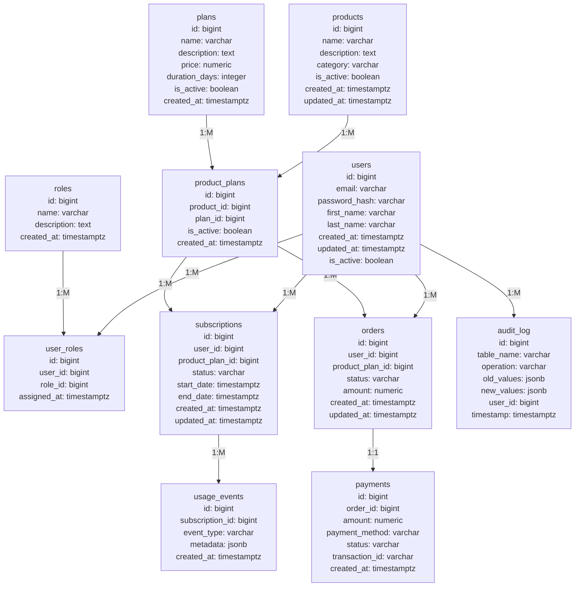

# ER-диаграмма и словарь данных для магазина подписок на нейросети

## ER-диаграмма (Mermaid)

## Словарь данных

### 1. users - Пользователи системы
- **id** (bigint, PK) - Уникальный идентификатор пользователя
- **email** (varchar(255), UNIQUE, NOT NULL) - Email пользователя для входа
- **password_hash** (varchar(255), NOT NULL) - Хеш пароля пользователя
- **first_name** (varchar(100), NOT NULL) - Имя пользователя
- **last_name** (varchar(100), NOT NULL) - Фамилия пользователя
- **created_at** (timestamptz, NOT NULL, DEFAULT now()) - Дата создания записи
- **updated_at** (timestamptz, NOT NULL, DEFAULT now()) - Дата последнего обновления
- **is_active** (boolean, NOT NULL, DEFAULT true) - Статус активности пользователя

### 2. roles - Роли пользователей
- **id** (bigint, PK) - Уникальный идентификатор роли
- **name** (varchar(50), UNIQUE, NOT NULL) - Название роли
- **description** (text) - Описание роли
- **created_at** (timestamptz, NOT NULL, DEFAULT now()) - Дата создания роли

### 3. user_roles - Связь пользователей и ролей (M:M)
- **id** (bigint, PK) - Уникальный идентификатор связи
- **user_id** (bigint, FK, NOT NULL) - Ссылка на пользователя
- **role_id** (bigint, FK, NOT NULL) - Ссылка на роль
- **assigned_at** (timestamptz, NOT NULL, DEFAULT now()) - Дата назначения роли

### 4. products - Продукты (нейросети)
- **id** (bigint, PK) - Уникальный идентификатор продукта
- **name** (varchar(200), NOT NULL) - Название нейросети
- **description** (text) - Описание возможностей нейросети
- **category** (varchar(100)) - Категория нейросети
- **is_active** (boolean, NOT NULL, DEFAULT true) - Статус активности продукта
- **created_at** (timestamptz, NOT NULL, DEFAULT now()) - Дата создания
- **updated_at** (timestamptz, NOT NULL, DEFAULT now()) - Дата последнего обновления

### 5. plans - Тарифные планы
- **id** (bigint, PK) - Уникальный идентификатор плана
- **name** (varchar(100), NOT NULL) - Название тарифного плана
- **description** (text) - Описание плана
- **price** (numeric(12,2), NOT NULL, CHECK > 0) - Стоимость плана
- **duration_days** (integer, NOT NULL, CHECK > 0) - Продолжительность в днях
- **is_active** (boolean, NOT NULL, DEFAULT true) - Статус активности плана
- **created_at** (timestamptz, NOT NULL, DEFAULT now()) - Дата создания

### 6. product_plans - Связь продуктов и планов (M:M)
- **id** (bigint, PK) - Уникальный идентификатор связи
- **product_id** (bigint, FK, NOT NULL) - Ссылка на продукт
- **plan_id** (bigint, FK, NOT NULL) - Ссылка на план
- **is_active** (boolean, NOT NULL, DEFAULT true) - Статус активности связи
- **created_at** (timestamptz, NOT NULL, DEFAULT now()) - Дата создания

### 7. subscriptions - Подписки пользователей
- **id** (bigint, PK) - Уникальный идентификатор подписки
- **user_id** (bigint, FK, NOT NULL) - Ссылка на пользователя
- **product_plan_id** (bigint, FK, NOT NULL) - Ссылка на связь продукт-план
- **status** (varchar(20), NOT NULL, CHECK IN ('active', 'expired', 'cancelled')) - Статус подписки
- **start_date** (timestamptz, NOT NULL) - Дата начала подписки
- **end_date** (timestamptz, NOT NULL) - Дата окончания подписки
- **created_at** (timestamptz, NOT NULL, DEFAULT now()) - Дата создания
- **updated_at** (timestamptz, NOT NULL, DEFAULT now()) - Дата последнего обновления

### 8. orders - Заказы
- **id** (bigint, PK) - Уникальный идентификатор заказа
- **user_id** (bigint, FK, NOT NULL) - Ссылка на пользователя
- **product_plan_id** (bigint, FK, NOT NULL) - Ссылка на связь продукт-план
- **status** (varchar(20), NOT NULL, CHECK IN ('pending', 'confirmed', 'cancelled', 'completed')) - Статус заказа
- **amount** (numeric(12,2), NOT NULL, CHECK > 0) - Сумма заказа
- **created_at** (timestamptz, NOT NULL, DEFAULT now()) - Дата создания
- **updated_at** (timestamptz, NOT NULL, DEFAULT now()) - Дата последнего обновления

### 9. payments - Платежи
- **id** (bigint, PK) - Уникальный идентификатор платежа
- **order_id** (bigint, FK, NOT NULL) - Ссылка на заказ
- **amount** (numeric(12,2), NOT NULL, CHECK > 0) - Сумма платежа
- **payment_method** (varchar(50), NOT NULL) - Способ оплаты
- **status** (varchar(20), NOT NULL, CHECK IN ('pending', 'completed', 'failed', 'refunded')) - Статус платежа
- **transaction_id** (varchar(100)) - Внешний идентификатор транзакции
- **created_at** (timestamptz, NOT NULL, DEFAULT now()) - Дата создания

### 10. usage_events - События использования
- **id** (bigint, PK) - Уникальный идентификатор события
- **subscription_id** (bigint, FK, NOT NULL) - Ссылка на подписку
- **event_type** (varchar(50), NOT NULL) - Тип события использования
- **metadata** (jsonb) - Дополнительные данные события
- **created_at** (timestamptz, NOT NULL, DEFAULT now()) - Дата создания события

### 11. audit_log - Журнал аудита
- **id** (bigint, PK) - Уникальный идентификатор записи аудита
- **table_name** (varchar(50), NOT NULL) - Название таблицы
- **operation** (varchar(10), NOT NULL, CHECK IN ('INSERT', 'UPDATE', 'DELETE')) - Тип операции
- **old_values** (jsonb) - Предыдущие значения записи
- **new_values** (jsonb) - Новые значения записи
- **user_id** (bigint, FK) - Ссылка на пользователя, выполнившего операцию
- **timestamp** (timestamptz, NOT NULL, DEFAULT now()) - Время выполнения операции

## Типы связей

- **1:1** - Заказ и платеж (один заказ - один платеж)
- **1:M** - Пользователь и подписки, продукт и связи с планами
- **M:M** - Пользователи и роли, продукты и планы (через промежуточные таблицы)

## Ограничения целостности

- Все внешние ключи с ON DELETE RESTRICT и ON UPDATE CASCADE
- Проверки на положительные значения для цен и длительности
- Ограничения на статусы (CHECK constraints)
- Уникальность email пользователей
- Уникальность названий ролей
